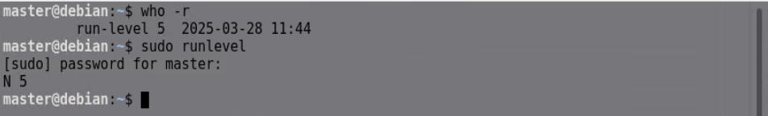
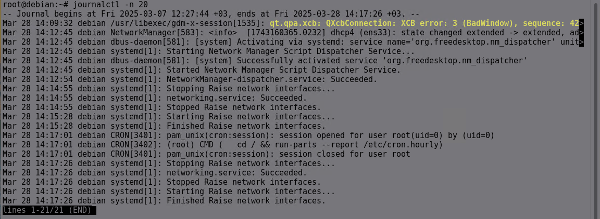

# **Linux Önyükleme Süreci**

Bir bilgisayarın açılışından itibaren işletim sisteminin yüklenmesine kadar geçen süreci "önyükleme süreci" olarak adlandırırız. Linux önyükleme süreci, temel donanım testlerinden başlayarak, çekirdek başlatma ve kullanıcı girişine kadar uzanan birkaç adımdan oluşur.

---

## **Adım 1: BIOS/UEFI ve Açılışta Kendi Kendine Test (POST)**
Linux işletim sistemine sahip bir bilgisayarın açılışında ilk olarak BIOS veya UEFI çalışır. Bu aşama, bilgisayarın temel donanım bileşenlerinin düzgün çalıştığını doğrulamak için gerçekleştirilir.

### **BIOS ve POST (Power-On Self-Test)**
BIOS, anakarta yerleşik olan düşük seviyeli bir ürün yazılımıdır. Bilgisayarın güç düğmesine basıldığında BIOS devreye girer ve şu işlemleri gerçekleştirir:
- **POST sürecini başlatır.**
- CPU, RAM, klavye, ekran kartı ve depolama aygıtları gibi temel bileşenleri kontrol eder.
- Hata tespit edilirse, bip sesleri veya ekrana hata kodları ile kullanıcıyı bilgilendirir.
- Başarılı bir POST testinden sonra önyükleme cihazını belirler.

### **UEFI (Unified Extensible Firmware Interface)**
BIOS'un modern alternatifi olan UEFI şunları sunar:
- **GPT (GUID Partition Table) desteği** sayesinde 2 TB'dan büyük diskleri destekler.
- **Hızlı önyükleme süresi** sunar.
- **Güvenli Önyükleme (Secure Boot)** desteği sağlar.

| Özellik | BIOS | UEFI |
|---------|------|------|
| Depolama Desteği | MBR (Maks. 2TB) | GPT (> 2TB) |
| Önyükleme Modu | Legacy Boot | Secure Boot Desteği |
| Hız | Daha yavaş | Daha hızlı |

---

## **Adım 2: Önyükleyicinin Yüklenmesi (Bootloader)**
Önyükleyici, işletim sisteminin çekirdeğini (kernel) belleğe yükleyerek sistemin çalışmasını başlatır.

### **Önyükleyicinin Görevleri**
- İşletim sisteminin çekirdeğini yüklemek.
- Kullanıcıya işletim sistemi seçeneklerini sunmak.
- Çekirdeğin ihtiyaç duyduğu geçici dosya sistemini (initramfs/initrd) yüklemek.

### **GRUB Önyükleyicisi Nasıl Çalışır?**
1. BIOS/UEFI, GRUB'u içeren bölümü bulur ve yükler.
2. GRUB, kullanıcıya işletim sistemlerini listeleyen bir menü sunar.
3. Kullanıcı seçim yaparsa, GRUB çekirdeği yükler ve initramfs/initrd dosyasını çalıştırır.

---

## **Adım 3: Linux Çekirdeğinin Yüklenmesi**
Önyükleyici, Linux çekirdeğini belleğe yükler ve çalıştırır. Initial RAM Disk adında bir imajdır. Çekirdek ve gerçek dosya sistemi yüklenmesi
sırasında yardımcı olan, geçici bir dosyadır. Tüm dizinler, işletim sistemine
burada bağlanır. İşletim sistemi başarılı şekilde yüklendiğinde işi biter. 

### **Çekirdek Ne Yapar?**
1. **Donanımı algılar.**
2. **Bellek yönetimini düzenler.**
3. **Aygıt sürücülerini yükler.**
4. **Dosya sistemlerini bağlar.**
5. **İlk kullanıcı alanı sürecini başlatır.**


---

## **Adım 4: Init Sistemi ve Çalıştırma Seviyeleri**
Linux çekirdeği yüklendikten sonra, init sistemi devreye girer ve çalışma
seviyesinde (runlevels’da) tanımlı olan işlemleri başlatır.


| Run Level | Diğer Adı  | Açıklama |
|-------------------|-----------------|--------------------------------------|
| 6 | reboot.target | Yeniden başlatma seviyesi. |
| 5 | graphical.target | Çok kullanıcılı grafik arayüz (GUI) modu. DE varsa buradayızdır. |
| 4 | (Boş) | Kişiselleştirilebilir. |
| 3 | multi-user.target | Çok kullanıcılı konsol modu. Ağ erişimi vardır. |
| 2 | multi-user.target | Çok kullanıcılı konsol modu. Ağ erişimi yoktur. |
| 1 | rescue.target | Tek kullanıcılı konsol modu. Ağ erişimi yoktur. |
| 0 | poweroff.target | HALT (Sistem çalışmaz durumdadır. Donanım, kesintiyi bekliyordur.) |

---

## **Adım 5: Kullanıcı Oturum Açma**
Tüm servisler başlatıldıktan sonra, kullanıcı giriş yapabilir.

- **CLI (Komut Satırı Girişi)**: TTY terminali üzerinden giriş yapılır.
- **GUI (Grafiksel Giriş Ekranı)**: GDM, LightDM, SDDM gibi giriş yöneticileri ile giriş yapılır.

---

```
runlevel

who -r 
```
Komutları kullanılarak şuan bulunduğunuz runleveli öğrenebilirsiniz.



```
ls /etc | grep ^rc
```
Komutunu kullanarak runlevel dosyalarını görebilirsiniz. 


```
ls -l /etc/rc5.d
```
Komutu ile dosyalarının içeriğini incelediğnizde. İncelediğiniz runlevel da hangi servislerin çalıştırılacağını bu dosyaların içerisinde yazar.


```
systemctl get-default
```
Komutunu kullanarak sistemin default olarak hangi runlevelı yüklediğini öğrenebilirsiniz.


```
sudo init <runlevel numarası>
```

Komutu ile istenilen runlevela geçiş yapılabilir.

# **Linux Servisler**

Linux işletim sisteminde service (hizmet), arka planda çalışan ve belirli bir görevi yerine getiren bir uygulama veya süreçtir. 

```
service --status-all
```
Komutuyla çalışan servisleri (+) çalışmayanları ise (-) ile görebilirsiniz. 


```
systemctl --type=service
```


### 1. Servis Durumunu Kontrol Etme

- `service` komutuyla:
    ```
    service <servis_adı> status
    ```
    Örnek: `service apache2 status`

- `systemctl` komutuyla:
    ```
    systemctl status <servis_adı>
    ```


### 2. Servisi Başlatma

- `service` komutuyla:
    ```
    sudo service <servis_adı> start
    ```
    Örnek: `sudo service apache2 start`

- `systemctl` komutuyla:
    ```
    sudo systemctl start <servis_adı>
    ```


### 3. Servisi Durdurma

- `service` komutuyla:
    ```
    sudo service <servis_adı> stop
    ```
    Örnek: `sudo service apache2 stop`

- `systemctl` komutuyla:
    ```
    sudo systemctl stop <servis_adı>
    ```

### 4. Servisi Yeniden Başlatma (Restart)

- `service` komutuyla:
    ```
    sudo service <servis_adı> restart
    ```
    Örnek: `sudo service apache2 restart`

- `systemctl` komutuyla:
    ```
    sudo systemctl restart <servis_adı>
    ```

### 5. Servisi Yeniden Yükleme (Reload)

- `service` komutuyla:
    ```
    sudo service <servis_adı> reload
    ```
    Örnek: `sudo service apache2 reload`

- `systemctl` komutuyla:
    ```
    sudo systemctl reload <servis_adı>
    ```

### 6. Servisi Etkinleştirme (Boot ile Başlatma)

- `service` komutuyla:
    ```
    sudo service <servis_adı> enable
    ```
    Örnek: `sudo service apache2 enable`

- `systemctl` komutuyla:
    ```
    sudo systemctl enable <servis_adı>
    ```

### 7. Servisi Devre Dışı Bırakma (Boot ile Başlatmama)

- `service` komutuyla:
    ```
    sudo service <servis_adı> disable
    ```
    Örnek: `sudo service apache2 disable`

- `systemctl` komutuyla:
    ```
    sudo systemctl disable <servis_adı>
    ```


> **Not:** `service` komutu, özellikle eski dağıtımlar ve bazı uyumluluk sağlama durumlarında kullanılır. Ancak çoğu modern Linux dağıtımında `systemctl` tercih edilmektedir.

```
sudo journalctl 
```
```
sudo journalctl -n <sayı>
```


```
sudo journalctl -u <servisina adı>
```


```
sudo journalctl --since "1 hour ago"

```
---

## Kaynakça

1. [How Linux Kernel Boots](https://www.geeksforgeeks.org/how-linux-kernel-boots/)